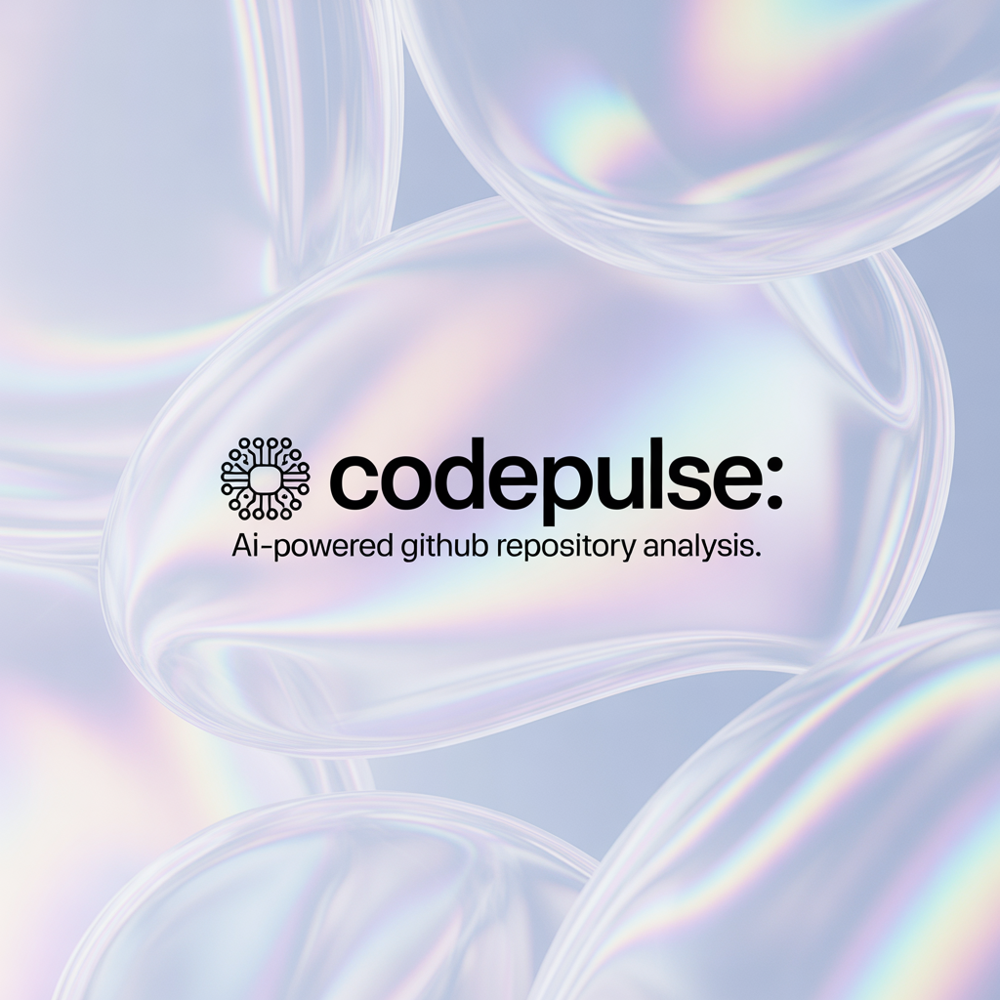

<div align="center">
  
</div>

# Building CodePulse: An AI-Powered Multi-Agent System for GitHub Repository Analysis

_How I built a capstone demonstration of multi-agent architecture using Google's Agent Development Kit - a foundation for repository intelligence platforms_

---

> **Note**: This is a capstone project demonstrating multi-agent architecture concepts from Google's AI Agents Intensive course. The implementation uses simulated data to showcase agent coordination patterns and MCP integration structure. For production use, real API integrations would need to be implemented.

---

## The Problem: Development Teams Flying Blind

As a Lead Architect working with engineering teams across multiple products, I've witnessed a recurring pattern: teams accumulate technical debt invisibly, security vulnerabilities go undetected, and there's no unified view of development efficiency. The existing solutions? GitHub provides basic stats, while commercial platforms like CodeClimate and SonarQube cost thousands per month and still don't provide AI-powered contextual insights.

For my capstone project in Google's AI Agents Intensive course, I wanted to demonstrate how a multi-agent system could address this problem. The result is **CodePulse** - a proof-of-concept that showcases intelligent repository analysis through coordinated specialized agents.

---

## Why Multi-Agent Architecture?

Rather than building a monolithic analysis tool, I chose a multi-agent approach inspired by the course curriculum. Each specialized agent handles one responsibility:

1. **Repository Analysis Agent** - Fetches commits, PRs, issues, and contributor data
2. **Code Quality Agent** - Analyzes complexity, duplication, and technical debt
3. **Development Metrics Agent** - Calculates DORA metrics (the gold standard for DevOps performance)
4. **Security Scanner Agent** - Detects secrets, vulnerabilities, and best practice violations
5. **Insights Agent** - Generates AI-powered recommendations with ROI estimates
6. **Report Generator Agent** - Synthesizes everything into actionable intelligence

A **Coordinator Agent** orchestrates this entire workflow, managing dependencies and ensuring agents execute in the right sequence (or in parallel where possible).

---

## The Technical Stack

**Google Agent Development Kit (ADK)**: The foundation for building multi-agent systems with built-in coordination patterns

**Model Context Protocol (MCP)**: Provides a clean abstraction layer between agents and tools, making the system extensible

**Gemini LLM**: Powers the insights engine for contextual analysis and recommendations

**Python + AsyncIO**: Enables concurrent agent execution for better performance

The beauty of this architecture is its modularity. Want to add a new analysis type? Just create a new agent. Need to change how data is fetched? Update the MCP server interface, and all agents benefit without code changes.

---

## Important Note: Demonstration Architecture

**This capstone project demonstrates the architecture and coordination patterns, not production integrations.**

### What's Implemented:

✅ Complete multi-agent coordination system
✅ MCP protocol structure and agent-tool communication patterns  
✅ Realistic data simulation that mirrors real API responses
✅ Full workflow from data collection to insights generation
✅ All agent interfaces and coordination logic

### What Would Need Production Implementation:

🔧 **Real GitHub API Integration**: Currently uses simulated data with realistic patterns (weekday/weekend commit distributions, power-law contributor patterns, varied PR lead times)

🔧 **MCP Server Implementations**: The MCP server interfaces are defined and used by agents, but connect to mock data generators rather than actual tools. For production:

- GitHub API Tools Server needs real REST API calls
- Code Analysis Tools Server needs actual code parsing libraries
- Reporting Tools Server needs real visualization generation

🔧 **Authentication & Security**: GitHub token management, rate limiting, error handling for API failures

🔧 **Data Persistence**: Historical tracking, trend analysis, database integration

**The architecture is designed to make these transitions straightforward** - agent code remains unchanged when swapping mock implementations for real ones. This separation of concerns is a core principle of the MCP protocol.

---

## Key Capabilities

### 1. Development Performance (DORA Metrics)

CodePulse calculates the four key DORA metrics that separate high-performing from low-performing teams:

- **Deployment Frequency**: How often code ships to production
- **Lead Time for Changes**: Time from code commit to production
- **Mean Time to Recovery**: How quickly teams recover from incidents
- **Change Failure Rate**: Percentage of deployments causing failures

The system demonstrates how these metrics can be calculated from repository data and contextualized against industry benchmarks with actionable recommendations.

### 2. Code Quality Analysis

The demonstration includes analysis of:

- Cyclomatic complexity patterns
- Technical debt accumulation indicators
- Code duplication detection
- Maintainability index calculation
- Test coverage assessment

Each finding comes with an estimated ROI framework for prioritization.

### 3. Security Intelligence

The Security Scanner Agent demonstrates detection of:

- Hardcoded secrets (API keys, tokens, credentials)
- Known vulnerabilities in dependencies (with CVE references)
- Security best practice violations

Critical findings are automatically prioritized with immediate action recommendations.

### 4. AI-Powered Insights

This is where the system demonstrates its value. The Insights Agent doesn't just report problems - it:

- Compares metrics to industry standards
- Estimates the business impact of each issue (e.g., "$15K-30K annually in faster time-to-market")
- Prioritizes recommendations by urgency and ROI
- Creates immediate, short-term, and long-term action plans

---

## Real-World Example Output

Let's say CodePulse analyzes your repository and finds:

```
❌ High PR Lead Time Detected (Priority: 9/10)
   Description: PRs take 8.5 days on average (industry best: <3 days)
   Impact: Delays feature delivery by 5.5 days per PR
   Recommendation: Implement 24-48h code review SLA, distribute code ownership
   Estimated ROI: 25% improvement ($15K-30K annually)
```

This isn't just a metric - it's the pattern for actionable intelligence. Your team would know exactly what's wrong, why it matters, and what to do about it.

---

## The Multi-Agent Coordination Pattern

One of the most interesting architectural decisions was how agents communicate. I implemented a three-phase execution pattern:


**Phase 1: Data Collection**

```
Repository Analysis Agent runs first, gathering all raw data
```

**Phase 2: Parallel Analysis**

```
Code Quality, DORA Metrics, and Security Scanner run concurrently
(Each works on the data independently, maximizing performance)
```

**Phase 3: Synthesis**

```
Insights Agent combines all findings
Report Generator creates the final deliverable
```

The Coordinator Agent maintains a shared results dictionary that serves as memory across the workflow. Each agent contributes its analysis, and later agents can access everything that came before - a key demonstration of the memory management concepts from Day 3 of the course.

---

## Model Context Protocol (MCP) Integration

MCP was a game-changer for this architecture. Rather than hardcoding tool calls, I defined three MCP server interfaces:

**GitHub API Tools Server**

```python
- get_repository_metadata()
- get_commits()
- get_pull_requests()
- get_issues()
- get_contributors()
```

**Code Analysis Tools Server**

```python
- analyze_complexity()
- detect_duplicates()
- identify_code_smells()
- calculate_maintainability()
```

**Reporting Tools Server**

```python
- generate_insights()
- create_visualizations()
- calculate_roi()
```

**Current Implementation**: For the capstone demonstration, these servers connect to intelligent mock data generators that produce realistic patterns.

**Production Path**: The agent code remains unchanged - only the MCP server implementations need to be swapped to call real APIs and tools. Agents call tools through MCP without knowing implementation details, demonstrating the abstraction and modularity that makes the system extensible.

This means the system could support GitHub, GitLab, or Bitbucket by simply creating new MCP server implementations without changing any agent code.

---

## Challenges and Solutions

### Challenge 1: Demonstrating Real Patterns Without API Dependencies

**Solution**: I implemented intelligent mocking that generates realistic patterns:

- Weekday/weekend commit distributions
- Power-law contributor patterns (few very active, many occasional)
- Varied PR lead times with 80/20 distribution (most fast, some slow)
- Realistic security findings with actual CVE format

This allows the notebook to demonstrate the complete workflow while remaining reproducible for reviewers without requiring API tokens or dealing with rate limits.

### Challenge 2: Agent Coordination Complexity

**Solution**: The Coordinator Agent pattern centralizes orchestration logic. Each individual agent stays simple and focused. Adding new analysis steps is straightforward - just add a new agent and update the coordinator's execution sequence.

### Challenge 3: Making Insights Actionable

**Solution**: Every insight includes:

- Severity rating (critical/high/medium/low)
- Priority score (1-10)
- Industry benchmark comparison
- Specific recommendation
- Estimated ROI with dollar amounts

This demonstrates how to transform raw metrics into business value - a key requirement for enterprise adoption.

---

## Performance Optimization

The system completes a full analysis cycle in under 60 seconds through:

1. **Parallel execution** where agents don't depend on each other (async/await patterns)
2. **Efficient data structures** (agents share a single results dictionary)
3. **Smart data generation** (pre-computed patterns loaded quickly)

In production, additional optimizations would include:

- API response caching
- Incremental analysis (only new commits)
- Background job processing for large repositories

---

## Path to Production

While this was built as a capstone demonstration, the architecture provides a solid foundation for production deployment:

**What's Already There:**

- ✅ Multi-agent coordination patterns
- ✅ MCP abstraction layer
- ✅ Memory management across agents
- ✅ Parallel execution framework
- ✅ Insights generation logic
- ✅ Health scoring algorithms

**What Would Need Implementation:**

**Step 1**: Implement Real MCP Servers

```python
# Current (Demo)
class GitHubToolsServer:
    async def call_tool(self, tool_name, **kwargs):
        return self._generate_mock_data(tool_name, **kwargs)

# Production (Real Integration)
class GitHubToolsServer:
    async def call_tool(self, tool_name, **kwargs):
        return await self.github_api.call(tool_name, **kwargs)
```

**Step 2**: Add persistent storage for historical analysis

**Step 3**: Wrap in a REST API (FastAPI makes this straightforward)

**Step 4**: Deploy with containerization (Docker)

**Step 5**: Add authentication, rate limiting, error handling

The multi-agent architecture, MCP integration patterns, and workflow orchestration remain unchanged - these production additions are infrastructure and integration layers around the core system.

---

## Key Learnings from the AI Agents Course

This project demonstrates practical application of all five days from Google's AI Agents Intensive:

**Day 1 - Agent Architecture**: Multi-agent coordination with clear separation of concerns. Each agent has a single responsibility, and the Coordinator manages the workflow.

**Day 2 - Tools & MCP**: Tool abstraction through Model Context Protocol. The MCP layer allows agents to call tools without knowing implementation details, making the system modular and extensible.

**Day 3 - Memory**: Shared state management across agent workflows. The coordinator maintains a results dictionary that serves as memory, allowing later agents to build on earlier analysis.

**Day 4 - Evaluation**: Built-in DORA metrics calculation and comprehensive performance logging throughout the workflow.

**Day 5 - Deployment**: Agent-to-agent communication patterns ready for production deployment, with clear separation between business logic and infrastructure concerns.

The course emphasized that agents should be composable, maintainable, and scalable - principles that guided every design decision in CodePulse.

---

## Impact and Use Cases

The patterns demonstrated in CodePulse address real pain points for:

**Engineering Teams**: Framework for continuous visibility into code quality and velocity

**Engineering Managers**: Architecture for data-driven insights to improve team performance

**DevOps Teams**: Blueprint for automated assessment of deployment pipeline health

**Open Source Maintainers**: Pattern for understanding project health at a glance

**Security Teams**: Structure for proactive vulnerability detection

The ROI-focused insights framework transforms this from a metrics dashboard into a decision support system architecture.

---

## What's Next?

If this were to evolve into a production system, the roadmap would include:

**v1.1 (Infrastructure Layer)**:

- Real GitHub API integration with authentication
- MCP server implementations for actual tools
- Database for historical data
- Basic REST API

**v2.0 (Enhancement Layer)**:

- Historical trend analysis (month-over-month tracking)
- Comparative benchmarking against similar repositories
- Multi-repository dashboard
- Integration with Jira, Slack, GitHub Issues

**v3.0 (Intelligence Layer)**:

- ML-based anomaly detection
- Predictive analytics for forecasting metrics
- Automated PR recommendations
- Team performance coaching

---

## Try It Yourself

The complete demonstration is available on Kaggle: [CodePulse Notebook](https://www.kaggle.com/code/shazimsurmawala/codepulse)

### To Explore the Architecture:

1. **Fork the notebook** on Kaggle
2. **Run the notebook** - no setup required

   - Uses simulated data for consistent demonstration
   - Complete analysis workflow executes in under 60 seconds
   - All outputs are generated for review

3. **Review the architecture**:

   - See how 6 agents coordinate through the Coordinator
   - Observe MCP integration patterns
   - Study the insights generation framework

4. **Experiment with the code**:
   - Modify agent logic to see how changes propagate
   - Adjust thresholds for insights generation
   - Try different repository configurations

> **Note**: The current notebook uses simulated data to demonstrate the multi-agent architecture. To analyze real repositories, you would need to:
>
> - Implement the MCP server backends (GitHub API, code analysis tools)
> - Add your GitHub API token to Kaggle Secrets
> - Update the data source methods to call real APIs instead of mock generators
> - Add error handling for API failures and rate limits

**The agent coordination, workflow patterns, and insights generation logic would remain unchanged** - demonstrating how the architecture separates concerns between business logic and data sources.

---

## Conclusion

Building CodePulse taught me that multi-agent systems aren't just academic concepts - they're practical architectural patterns for solving complex real-world problems. By breaking repository analysis into specialized agents coordinated through MCP, the system becomes modular, testable, and extensible.

While this is a demonstration project using simulated data, the architecture showcases how DORA metrics, code quality analysis, security scanning, and AI-powered insights can be combined into a comprehensive development intelligence platform. More importantly, the agent coordination patterns and MCP integration structure provide a solid foundation for production implementation.

Whether you're an engineering leader exploring development intelligence platforms, or a developer interested in multi-agent architectures, I hope CodePulse demonstrates the power of thoughtful multi-agent design and the value of separation of concerns through MCP.

The key takeaway: **focus first on architecture and coordination patterns**, then layer on production integrations. This approach, emphasized throughout the AI Agents Intensive course, creates systems that are easier to test, maintain, and evolve.

---

## Technical Details

**Project**: CodePulse - AI-Powered Repository Health & Performance Analyzer (Capstone Demonstration)  
**Architecture**: Multi-Agent System with 6 specialized agents + Coordinator  
**Framework**: Google Agent Development Kit (ADK) concepts  
**Integration Pattern**: Model Context Protocol (MCP)  
**Language**: Python 3.11+  
**Key Libraries**: asyncio, pydantic, dataclasses  
**Deployment**: Kaggle Notebook (portable to any Python environment)  
**Data Approach**: Simulated data with realistic patterns for demonstration

**Competition**: Kaggle AI Agents Intensive Capstone (Enterprise Track)  
**Course**: Google AI Agents Intensive (5-day program)  
**Author**: Shazim Surmawala  
**Date**: November 2025

---

## Connect

I'd love to hear your thoughts on multi-agent architectures or discuss how these patterns might apply to your projects!

- **LinkedIn**: [linkedin.com/in/shazim-surmawala](https://www.linkedin.com/in/shazim-surmawala)
- **GitHub**: [github.com/sshazim](https://github.com/sshazim)
- **Kaggle Notebook**: [CodePulse Demo](https://www.kaggle.com/code/shazimsurmawala/codepulse)
- **Github** [CodePulse](https://github.com/sshazim/CodePulse)

---

_This blog post describes the capstone project for Google & Kaggle's AI Agents Intensive Course. The project demonstrates practical application of multi-agent architectures, MCP integration patterns, and coordination design - providing a foundation for production development intelligence platforms._

**Tags**: #AI #MachineLearning #MultiAgent #SoftwareEngineering #DevOps #GitHub #DORA #CodeQuality #AgenticAI #MCP
